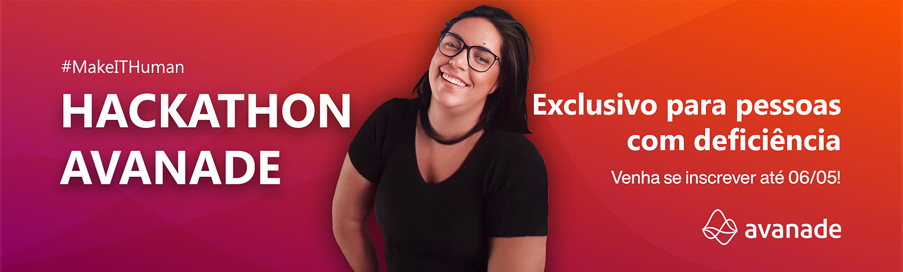
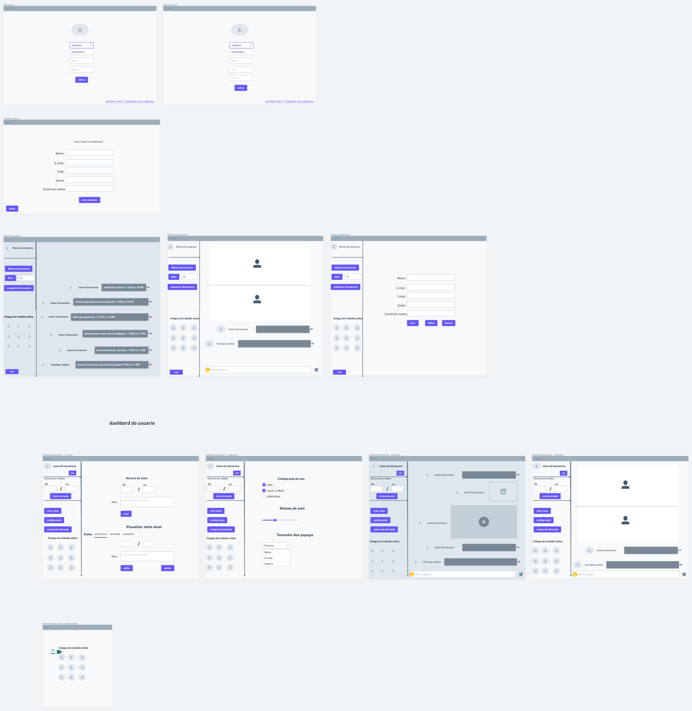

# Projeto-Hackathon-Avanade

## fui um dos privilegiados a participar desse maravilhoso evento que aconteceu nos dias 15 a 16 de 2021 do mes de maio

## o tema foi inovação em soluções workplace

# sobre minha aplicação

### desenvolvemos uma aplicação penssando no publico que trabalha em home office e precisa enfrentar alguns desafios como

* Destração com atividades domesticas
* Queda de produtividade
* isolamentos sociais 
* aumento de cobrança 

## nossa solução 

### Uma aplicação para auxiliar os colaboradores que trabalham em home office , esse app irá ajudar a enfrentar os maiores desafios de trabalhar em casa , como  procrastinação com assuntos internos domiciliar, Tendência ao isolamento social,Baixa produtividade devido a fatores domésticos .

# rototipo 
*
